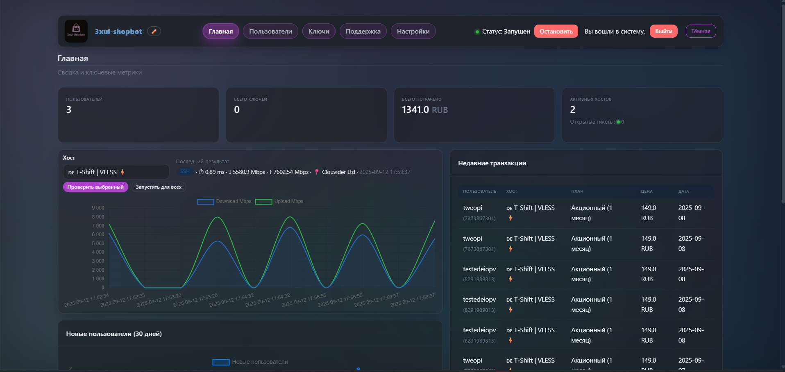
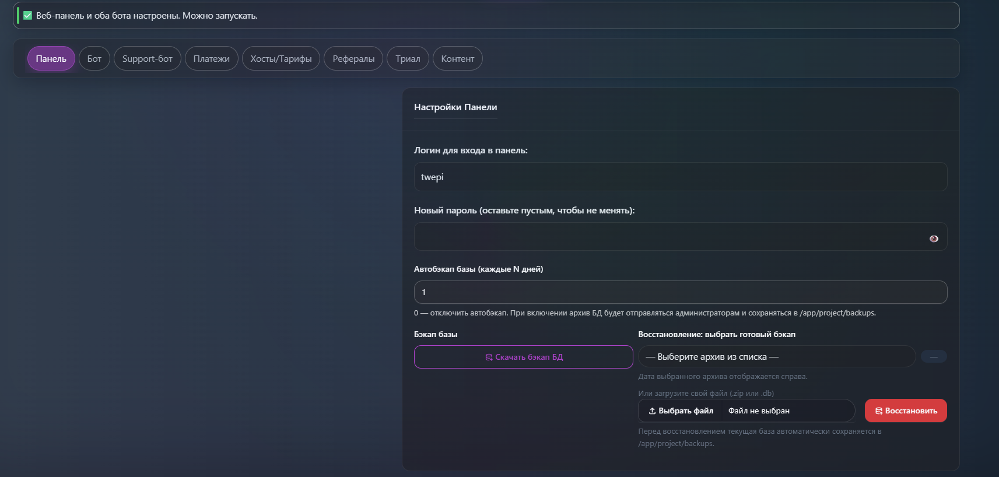
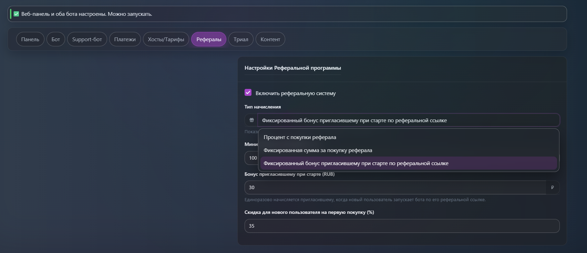
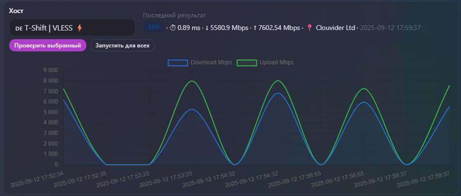
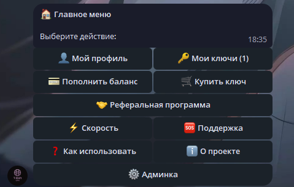
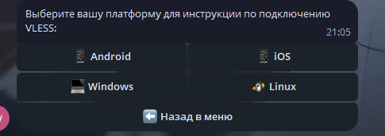
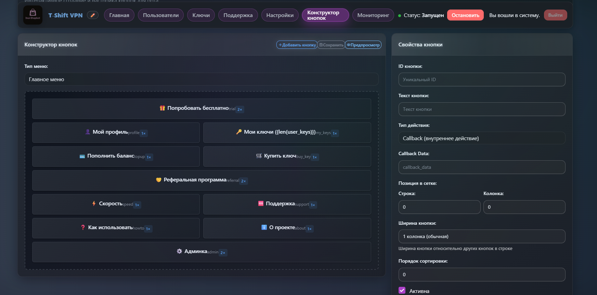
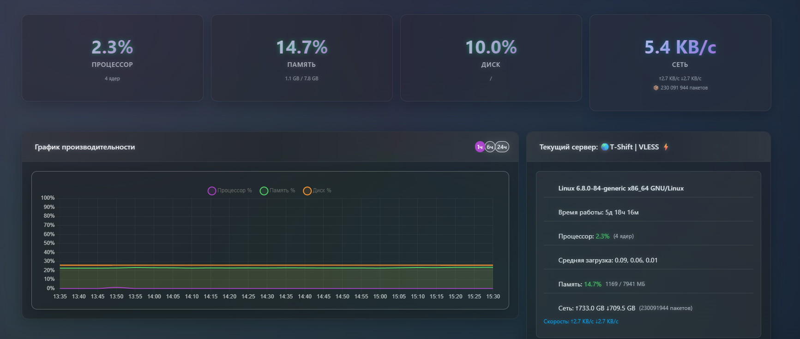

<div align="center" markdown>
  <h1>Remnawave ShopBot | Telegram-бот для продажи VPN</h1>
  <p align="center">
    <a href="#-%D1%83%D1%81%D1%82%D0%B0%D0%BD%D0%BE%D0%B2%D0%BA%D0%B0-%D0%BF%D0%BE%D0%B4-%D0%BA%D0%BB%D1%8E%D1%87">Установка и обновление</a> •
    <a href="#-%D0%B1%D0%B0%D0%B3%D0%B8-%D0%B8-%D0%BF%D1%80%D0%B5%D0%B4%D0%BB%D0%BE%D0%B6%D0%B5%D0%BD%D0%B8%D1%8F">Баги и предложения</a> •
    <a href="#%D0%BF%D0%BE%D0%B4%D0%B4%D0%B5%D1%80%D0%B6%D0%BA%D0%B0-%D0%BF%D0%BE-%D0%BF%D1%80%D0%BE%D0%B5%D0%BA%D1%82%D1%83">Поддержка по проекту</a> •
    <a href="https://t.me/+0a2q3H5G7JU4NDMy">Группа для соискателей</a> •
    <a href="#-%D0%BF%D0%BE%D0%B4%D0%B4%D0%B5%D1%80%D0%B6%D0%B0%D1%82%D1%8C-%D1%80%D0%B0%D0%B7%D1%80%D0%B0%D0%B1%D0%BE%D1%82%D0%BA%D1%83">Поддержать проект</a>
  </p>
  <p align="center">
    <a href="https://github.com/tweopi/remnawave-shopbot/releases" target="_blank">
      
    </a>
    <a href="https://github.com/tweopi/remnawave-shopbot/releases" target="_blank">
      
    </a>
    <a href="https://github.com/tweopi/remnawave-shopbot/blob/main/LICENSE" target="_blank">
      
    </a>
    <a href="https://github.com/tweopi/remnawave-shopbot/commits" target="_blank">
      
    </a>
    <a href="https://github.com/tweopi/remnawave-shopbot/issues" target="_blank">
      
    </a>
    <a href="https://github.com/tweopi/remnawave-shopbot/stargazers" target="_blank">
      
    </a>
    <a href="https://www.python.org/downloads/" target="_blank">
      
    </a>
  </p>
</div>

**Remnawave ShopBot** — комплексное решение для автоматизированной продажи VPN‑конфигураций через Telegram с веб‑панелью на базе Tabler и интеграцией с Remnawave Platform.

---

## Основные возможности

- Полностью автоматизированная воронка: онбординг пользователя, проверка подписки и выдача конфигурации сразу после оплаты.
- Единая панель управления: управление хостами Remnawave Platform, тарифами, пользователями, платежами, журналами и спидтестами.
- Гибкая биллинг-модель: поддержка множества серверов, индивидуальных тарифов, пробных периодов и реферальных начислений.
- Интеграция с YooKassa, CryptoBot, Heleket и TON Connect, включая вебхуки и отправку чеков YooKassa.
- Построение отчётов и диагностика: принудительная подписка, встроенный саппорт, SSH/net-probe speedtest, мониторинг событий.

## 🖼️ Скриншоты
<details>
  <summary><b>Показать скриншоты</b></summary>

  <br>

  <table>
    <tr>
      <td align="center" valign="top">
        <a href="docs/screenshots/dashboard.png"></a><br>
        <sub>Панель — Дашборд</sub>
      </td>
      <td align="center" valign="top">
        <a href="docs/screenshots/settings.png"></a><br>
        <sub>Панель — Настройки</sub>
      </td>
    </tr>
    <tr>
      <td align="center" valign="top">
        <a href="docs/screenshots/referrals.png"></a><br>
        <sub>Рефералы</sub>
      </td>
      <td align="center" valign="top">
        <a href="docs/screenshots/speedtests.png"></a><br>
        <sub>Спидтесты</sub>
      </td>
    </tr>
    <tr>
      <td align="center" valign="top">
        <a href="docs/screenshots/bot-main-menu.png"></a><br>
        <sub>Бот — Главное меню</sub>
      </td>
      <td align="center" valign="top">
        <a href="docs/screenshots/bot-admin-menu.png"></a><br>
        <sub>Бот — Админ‑меню</sub>
      </td>
    </tr>
    <tr>
      <td align="center" valign="top">
        <a href="docs/screenshots/bot-settings.png"></a><br>
        <sub>Бот — Настройки/Помощь</sub>
      </td>
      <td align="center" valign="top">
        <a href="docs/screenshots/button_design.png"></a><br>
        <sub>Панель — Конструктор кнопок</sub>
      </td>
    </tr>
    <tr>
      <td align="center" valign="top">
        <a href="docs/screenshots/monitor.png"></a><br>
        <sub>Панель — Мониторинг системы</sub>
      </td>
      <td align="center" valign="top">
        <a href="docs/screenshots/preview.png"></a><br>
        <sub>Предпросмотр меню</sub>
      </td>
    </tr>
  </table>

  <br>
  <i>Клик по миниатюре откроет оригинал в полном размере.</i>
</details>

---

## ⚠️ Требования
1) Сервер Ubuntu/Debian с доступом по SSH.
2) Домен, A‑запись которого указывает на IP сервера.
3) Установленная Remnawave Platform на целевых хостах.

---

## 💻 Где купить сервер/домен
Если нет сервера/домена — можно приобрести здесь: [Hostoff](https://hostoff.net/vps?ref=CODEA251D760)

---

## 🛠️ Установка «под ключ»
Скрипт поставит Docker, Nginx, Certbot, скачает и развернёт бота и панель.

1) Подключитесь по SSH.

2) Выполните:

```bash
curl -sSL https://raw.githubusercontent.com/ASTRACAT2022/subBot-/main/install.sh | bash
```

3) Следуйте инструкциям установщика:
- Введите домен (например, `shop.example.com`).
- Укажите email для SSL (Let's Encrypt).
- Выберите порт для вебхуков (443 или 8443, по умолчанию 8443).
- Скрипт автоматически поднимет контейнеры и выпишет сертификат.

4) По завершении получите URL панели и первичные доступы:
```
Веб‑панель: https://your-domain.com:8443/login
Логин: admin
Пароль: admin
```

---

## ⚙️ Первичная настройка
1) Войдите в панель и сразу смените логин/пароль в «Настройки → Настройки панели».
2) Заполните Telegram‑параметры: `Токен бота`, `Имя телеграмм бота`, `ID администратора в телеграмме`.
3) Добавьте хост Remnawave Platform в «Настройки → Управление хостами» (URL, доступы и параметры подключения).
4) Создайте тарифы для добавленного хоста (месяцы/цена).
5) Сохраните настройки и нажмите «Запустить бота» в шапке панели.

Бот готов к работе.

---

## 💳 Платёжные системы
Откройте «Настройки → Настройки платёжных систем» и заполните соответствующие поля.

### YooKassa
- Укажите `yookassa_shop_id` и `yookassa_secret_key`.
- В кабинете YooKassa задайте URL вебхука: `https://your-domain.com/yookassa-webhook`
  Если при установке выбран порт `8443`, то: `https://your-domain.com:8443/yookassa-webhook`.
- При желании добавьте `Почту для чеков`.

### CryptoBot
- Получите токен в [@CryptoBot](https://t.me/CryptoBot) → Crypto Pay.
- Включите вебхуки на `https://your-domain.com/cryptobot-webhook` (или с портом `:8443`).
- Укажите `cryptobot_token` в настройках.

### Heleket
- Укажите `heleket_merchant_id` и `heleket_api_key`.

### TON Connect (опционально)
- Укажите `ton_wallet_address` и `tonapi_key` для курсов.

---

## 🔗 Принудительная подписка и ссылки
Ключевые настройки задаются в БД через веб‑панель:
- `force_subscription`: включить/выключить обязательную подписку (`true`/`false`).
- `channel_url`: ссылка на канал/чат для подписки. Бот должен быть админом канала.
- `terms_url`, `privacy_url`: ссылки на условия и политику — используются в онбординге.

---

## 🧪 Тест скорости (Speedtest)
Тесты скорости доступны из админ‑меню бота и из панели.

Поддерживаются 2 метода:
- SSH‑Speedtest: запуск `speedtest`/`speedtest-cli` на удалённом сервере по SSH.
- Net‑Probe: лёгкая сетевая проверка доступности и задержки HTTP с панели до `host_url`.

Результаты сохраняются в БД и видны на дашборде у каждого хоста.

### Настройки для SSH‑Speedtest на хосте
Откройте «Настройки → Управление хостами → SSH‑параметры» и заполните:
- `ssh_host` — адрес сервера
- `ssh_port` — порт (по умолчанию 22)
- `ssh_user` — пользователь
- `ssh_password` — пароль (или пусто, если используется ключ)
- `ssh_key_path` — путь к приватному ключу на машине панели (контейнер)

Можно запустить «Автоустановку speedtest» из админ‑меню и из веб‑панели.

### Запуск
- В боте: Админ‑меню → Speedtest → выбрать хост или «Запустить для всех».
- В панели: кнопка «Run speedtests» на дашборде.

---

## 🤝 Реферальная система
Основные параметры — в таблице настроек («Настройки → Общие»).
Типы начислений:
- Процент с покупки реферала
- Фиксированная сумма за покупку реферала
- Фиксированный бонус пригласившему при старте по реферальной ссылке

Дополнительно:
- Скидка для приглашённого (в процентах), если используется
- Минимальная сумма на вывод/перевод (если заложено в вашей бизнес‑логике)

Рефссылка формируется как: `https://t.me/<bot_username>?start=ref_<telegram_id>`.

---

## 🆘 Настройки поддержки (Support)
Доступны два режима:

1) Внешний саппорт‑бот
   - Поля: `support_bot_token`, `support_bot_username`, `support_text`.
   - Пользователь переходит в отдельного бота по кнопке «Помощь».

2) Внешний контакт
   - Поле: `support_user` (например, `@username`).
   - Кнопка ведёт в личные сообщения указанному контакту.

Дополнительно: `support_forum_chat_id` — ID форума/топиков для расширенных сценариев.

---

## 🔄 Управление и обновление
Все команды выполняются в каталоге проекта на сервере (папка `remnawave-shopbot`).

Просмотр логов в реальном времени:
```bash
docker-compose logs -f
```

Остановка контейнеров:
```bash
docker-compose down
```

Запуск в фоне:
```bash
docker-compose up -d
```

**Обновить до последней версии:**
```bash
curl -sSL https://raw.githubusercontent.com/tweopi/remnawave-shopbot/main/install.sh | bash

docker-compose down && docker-compose up -d --build
```

---

## 🙌 Баги и предложения
Нашли баг или есть идея? Создайте Issue или пришлите Pull Request. Также можно связаться: [@tweopi](https://t.me/tweopi)

## 💎 Поддержать разработку
**СБП/Карта РФ:** [Нажать чтобы поддержать](https://yookassa.ru/my/i/aJiSmSUeUie5/l)
**Т-Банк:**[Нажать чтобы поддержать](https://tbank.ru/cf/1JpNWKAFzqR)

## Поддержка по проекту
Техподдержка и сообщество: [t_shift_supportbot](https://t.me/t_shift_supportbot)

## Лицензия
Проект распространяется по лицензии [GPLv3](LICENSE).
